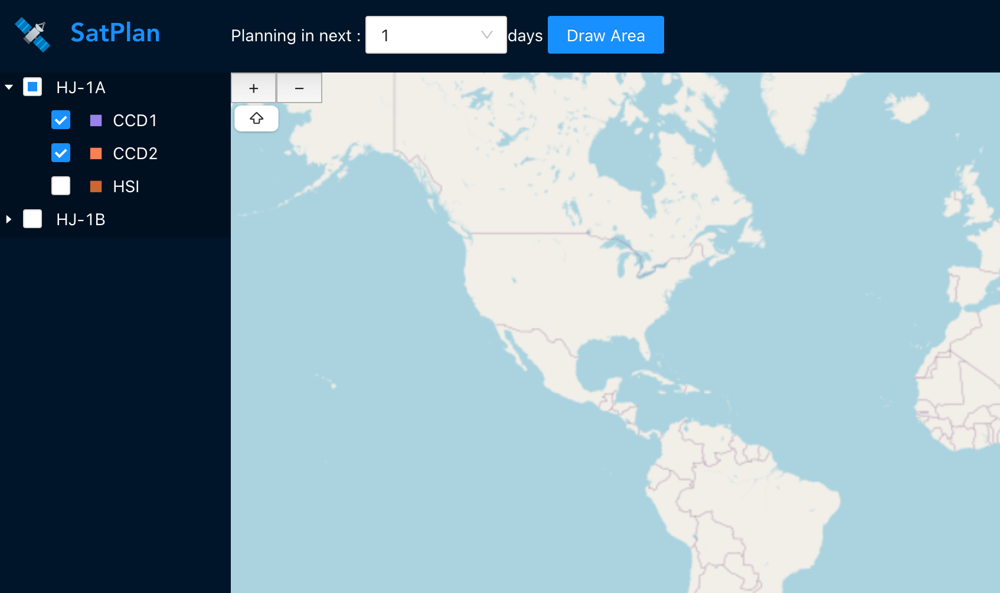
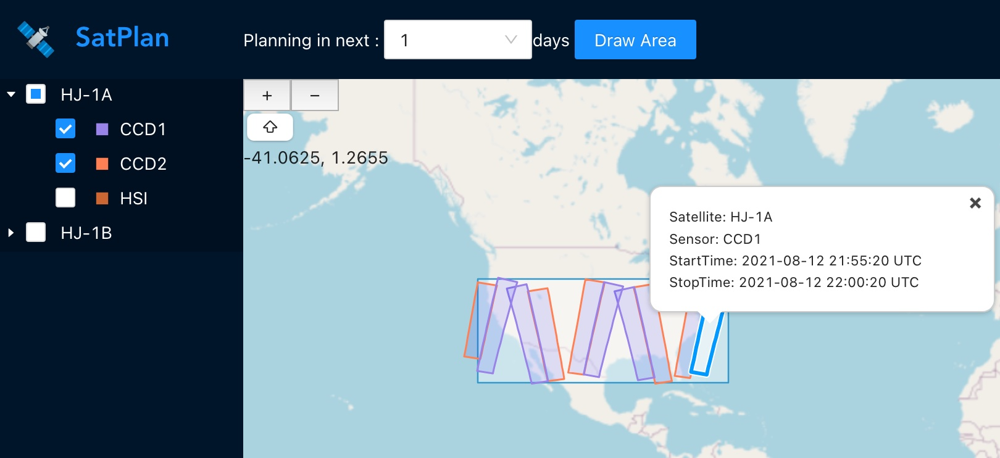
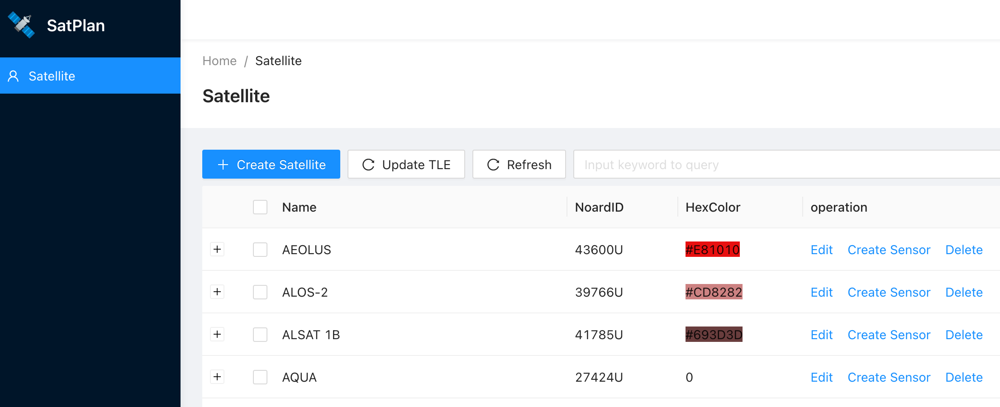
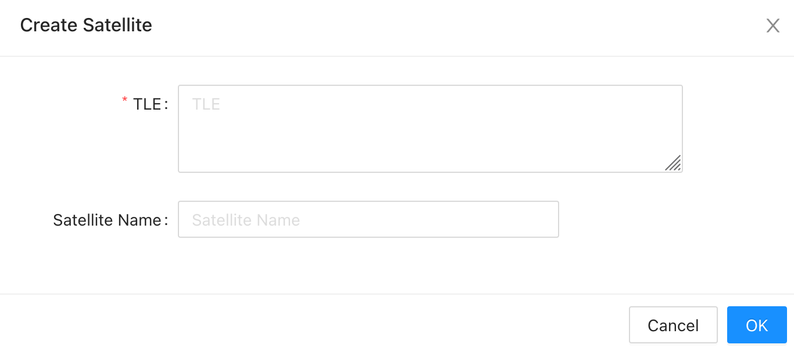

## About satplan
Satplan is a tool for planning missions of remote sensing satellites. With Satplan, users can obtain information about the sensor paths in their area of interest for the upcoming days.

Here is a demo site: https://satplan.fogsea.ga

### Key features
* Automatic calculation of satellite tracks and sensor paths using SGP4.
* Customizable management of satellites and sensors by users.
* Mission planning with auto-filtering of sensor paths based on interest area and time span.
* Display of planning results on a map, utilizing openlayers.

## Usage
* Install [Docker](https://docs.docker.com/installation/#installation)

* Install [docker-compose](https://docs.docker.com/compose/install/)

Please create a docker-compose.yml file with the following contents.
```yml
version: "3"
services:
  satplan:
    image: figwh/satplan:latest
    container_name: satplan
    environment:
      - BASE_URL=http://localhost:8080/
      - DATA_FOLDER=/app/data
    volumes:
      - ./data:/app/data
    ports:
      - 80:80
    restart: unless-stopped
```

Run with docker-compose:
```bash
docker-compose up -d
```
Satplan will be hosted on http://localhost

### Mission Planning
After starting the container, go to http://localhost to access the interface. The default satellites included are HJ-1A and HJ-1B, but users can add additional satellites or sensors as needed.


First, check the sensors. Then, click on the "Draw Area" button and draw a rectangle on the map. This will display sensor paths across the rectangular area. Clicking on a path will reveal its information.


Users can check or uncheck sensors and adjust the planning time, which will automatically update the results on the map.

### Satellite and sensor management
To access the satellite and sensor management page, go to http://localhost/admin and enter the default credentials (username: test@test.com, password: 12345678).


The new satellite requires Two-Line Element (TLE) data, which can be obtained from [NORAD](http://www.celestrak.com/NORAD/elements/resource.txt). The TLE data will be automatically updated every day at 00:00 am UTC.


## Structure
Satplan is comprised of four components: calpath, satplan-server, satplan-web, and satplan-pkg.

### database
Satplan currently utilizes SQLite for its functionality, but it has the potential to support other databases like MySQL.

### calpath
The calculation of satellite tracks and sensor paths is performed using C++ programming language. This process utilizes the [orbittools](http://www.zeptomoby.com/satellites/) software, developed by Michael F. Henry, which accurately calculates the satellite tracks.

### satplan-server
The backend, which is developed in Go, provides APIs for satplan-web.

### satplan-web
The frontend is developed using TypeScript and React, with Ant Design Pro serving as the web framework. OpenLayers is utilized to display both the world map and planning results.

### satplan-pkg
This package includes a Dockerfile, GitHub action, and relevant documentation for packaging purposes.

